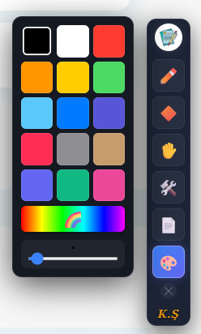

# ✒️ MathsPen - Ultimate Web Drawing Tool

**MathsPen**, web sayfalarını, PDF'leri ve yerel dosyaları sonsuz bir çalışma tuvaline dönüştüren profesyonel bir Chrome Uzantısıdır. Mühendisler, öğretmenler ve öğrenciler için özel olarak tasarlanmıştır.

> **Önemli:** Akıllı tahtalar ve dokunmatik ekranlar için özel olarak optimize edilmiştir.

---

## 🌟 Neden MathsPen?

MathsPen sıradan bir çizim aracı değildir. Web tarayıcısının sınırlarını zorlayan özel mühendislik çözümleri içerir:

### 🚀 Öne Çıkan Teknolojiler

*   **Zero-Jump Scroll Lock:** Kalem modundayken sayfa kaydırmasını (scroll) %100 kilitler. "El" aracı seçildiğinde ise tuval delinir ve sayfa doğal şekilde kaydırılır.
*   **Zoom Kalibrasyonu:** Sayfayı ne kadar yakınlaştırıp uzaklaştırırsanız uzaklaştırın (Zoom In/Out), çizimleriniz milimetrik olarak farenin ucunda kalır (Paralaks hatası giderilmiştir).
*   **Yapay Zeka Destekli Sihirli Kalem:** Kabaca çizdiğiniz daireleri, kareleri veya çizgileri algılar ve onları kusursuz geometrik şekillere dönüştürür.
*   **Pixel-Perfect UI:** Her ekrana sığan, taşma yapmayan, akıllı yönlendirmeli ve cam görünümlü (Glassmorphism) arayüz.

---

## 🎨 Özellikler

### ✏️ Gelişmiş Kalemler
*   **Akıllı Kalem:** El titremesini düzelten yumuşatma algoritması.
*   **Sihirli Kalem (Magic Pen):** Şekil tanıma ve düzeltme.
*   **Dolma Kalem:** Hıza duyarlı (Velocity sensing) basınç efekti.
*   **Fırça & Fosforlu Kalem:** Özel `multiply` modu ile yazıların üzerini kapatmadan boyama.
*   **Metin (Text):** Tıklanan yere yazı yazma özelliği.

### 📐 Mühendislik & Eğitim
*   **Özel Kağıtlar:** Kareli, Çizgili, **İzometrik (3D)**, Altıgen (Kimya) ve Noktalı kağıt desenleri.
*   **Geometrik Araçlar:** Koordinat sistemi, dik üçgen, daire, yıldız, paralelkenar ve çift yönlü oklar.
*   **Sunum Modu:** Ekranı karartıp sadece imleci aydınlatan **Spot Işığı** ve iz bırakan **Lazer**.

### 💻 Kullanıcı Deneyimi (UX)
*   **Yüzen Panel:** Logodan tutarak ekranın her yerine taşınabilir.
*   **Akıllı Menüler:** Panel ekranın sağındaysa menüler sola, solundaysa sağa açılır. Asla ekran dışına taşmaz.
*   **Görsel Slider:** Kalem kalınlığını ayarlarken canlı önizleme.

---

## 🛠️ Kurulum (Geliştirici Modu)

Bu proje açık kaynaklıdır ve manuel olarak kurulur:

1.  Bu repoyu **ZIP olarak indirin** ve klasöre çıkarın.
2.  Chrome tarayıcısında adres çubuğuna `chrome://extensions` yazın.
3.  Sağ üst köşedeki **"Geliştirici Modu" (Developer Mode)** anahtarını açın.
4.  Sol üstteki **"Paketlenmemiş öğe yükle" (Load Unpacked)** butonuna tıklayın.
5.  İndirdiğiniz `MathsPen` klasörünü seçin.

### 📂 Masaüstü Dosyaları Üzerinde Çalışmak İçin (Önemli!)
PDF veya bilgisayarınızdaki resimlerin üzerine çizim yapmak istiyorsanız:
1.  Uzantılar sayfasında MathsPen kartındaki **"Ayrıntılar"** butonuna tıklayın.
2.  Aşağı kaydırın ve **"Dosya URL'lerine erişime izin ver"** seçeneğini aktif hale getirin.

---

## 🎮 Nasıl Kullanılır?

| İkon | Araç | Açıklama |
| :--- | :--- | :--- |
| ✏️ | **Kalemler** | Akıllı, Sihirli, Dolma, Fırça ve Metin araçları. |
| 🔶 | **Şekiller** | Geometrik şekiller ve koordinat sistemi. |
| ✋ | **Kaydır** | Çizimi durdurur, sayfayı kaydırmanızı sağlar. |
| 🛠️ | **Araçlar** | Zoom (+/-), Lazer, Spot Işığı, Silgi, Geri/İleri Al. |
| 📄 | **Kağıt** | Arka plan desenlerini ve Koyu/Açık temayı değiştirir. |
| 🎨 | **Renk** | Renk paleti, özel renk seçici (🌈) ve kalınlık ayarı. |

---

## 🏗️ Proje Yapısı

*   `manifest.json`: Uzantı yetkileri ve konfigürasyonu (Manifest V3).
*   `content.js`: Tüm çizim motoru, algoritmalar ve UI mantığı (Tek dosya mimarisi).
*   `background.js`: Sayfa enjeksiyon tetikleyicisi.
*   `icon.png`: Uygulama ikonu.

## 🤝 Katkıda Bulunma

Pull request'ler kabul edilir. Büyük değişiklikler için lütfen önce neyi değiştirmek istediğinizi tartışmak üzere bir konu (issue) açınız.

## 📝 Lisans

[MIT](LICENSE) © 2026 **Kemal Şimşek**

---
*Bu proje, eğitim ve mühendislik dünyasına katkı sağlamak amacıyla ❤️ ile kodlanmıştır.*
